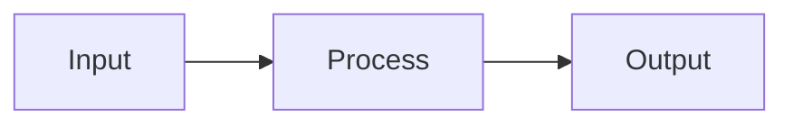

# Presentation Framework

A zero-server slide deck engine. Author slides in Markdown, build with one command, share as a single HTML file.

> **Internet connection required** for correct font rendering (fonts load from Google Fonts). All other content — slides, images, diagrams — is fully offline-capable after building.

---

## Quick reference

**Presentation content** — edit [slides.md](slides.md). Separate slides with `---`.

**Parameters** — all in [deck.json](deck.json):

| What | Key | Notes |
|---|---|---|
| Top image / video | `"image"` | Path to your image or video (e.g. `"assets/hero.png"`) |
| Theme | `"theme"` | See [Themes](#themes) |
| Transition speed | `"transition_duration_ms"` | Milliseconds (e.g. `500` = 0.5 s) |
| Zoom per slide | `slides[n].image_zoom` | `1.0` = normal, `1.8` = 80% zoomed in |
| Pan X per slide | `slides[n].image_center.x` | Pixel X in the image, or normalized 0–1 |
| Pan Y per slide | `slides[n].image_center.y` | Pixel Y in the image, or normalized 0–1 |

Each entry in `slides[]` maps to a slide in order (first entry = first slide, etc.).

**Regenerate after any change:**

```
node build.js
```

Then open `dist/index.html` in a browser.

---

## Quick start

```
node build.js
```

Then open `dist/index.html` in any browser (double-click it, or drag it into a browser tab). No web server needed.

---

## File structure

```
project/
├── slides.md       ← all slide content
├── deck.json       ← deck configuration
├── assets/
│   └── hero.png    ← panoramic hero image or video (replace with your own)
├── build.js        ← build script (do not edit)
└── dist/
    └── index.html  ← build output (open this in browser)
```

---

## Writing slides

All slides live in `slides.md`. Separate slides with `---` on its own line:

```markdown
# First Slide

Some content here.

---

# Second Slide

More content.
```

The first slide starts at the top of the file — no leading `---` needed.

### Supported Markdown

- Headings (`#`, `##`, `###`)
- Paragraphs, bold, italic, inline code
- Ordered and unordered lists
- Fenced code blocks (with language tags for styling)
- Mermaid diagrams (` ```mermaid `)
- Images (``)
- Tables
- Blockquotes
- Raw HTML (not sanitized — content is always local and user-authored)

### Mermaid diagrams

Write Mermaid diagrams inside a fenced code block tagged `mermaid`:

````markdown

````

---

## Configuring deck.json

```json
{
  "title": "My Deck",
  "theme": "midnight",
  "image": "assets/hero.jpg",
  "transition_duration_ms": 500,
  "slides": [
    { "image_zoom": 1.0, "image_center": { "x": 0.5, "y": 0.5 } },
    { "image_zoom": 1.4, "image_center": { "x": 0.2, "y": 0.6 } }
  ]
}
```

| Field | Description |
|---|---|
| `title` | Browser tab title |
| `theme` | Theme name — see [Themes](#themes) |
| `image` | Path to hero image or video relative to `deck.json` |
| `transition_duration_ms` | Slide transition speed in ms (default: 500) |
| `slides[].image_zoom` | Zoom level. `1.0` = cover-fit, `1.5` = 50% zoomed in. Min: 1.0 |
| `slides[].image_center` | Focal point as pixel coordinates `{x:552, y:563}` or normalized 0–1 values `{x:0.5, y:0.5}` |

**Important:** The number of entries in `slides[]` must exactly match the number of `---`-delimited slides in `slides.md`. The build script will error if they differ.

---

## Navigation

| Action | Trigger |
|---|---|
| Next slide | `→`, `Space`, or click the content area |
| Previous slide | `←` |
| Jump to slide | Click a dot indicator |
| Fullscreen | `F` key or the fullscreen button |
| Slide overview | `Escape` |
| Swipe | Left = next, right = previous (touch devices) |

---

## Rendering

Slides are always rendered at a fixed **16:9** reference resolution (1280 × 720) and then uniformly scaled to fill the window:

- **Wide window** — theme-coloured bars appear on the left and right.
- **Narrow / portrait window** — theme-coloured bars appear on the top and bottom.

The content layout never reflows — it scales as a single unit, so every window size looks identical.

---

## Themes

| Name | Style | Accent | Headings |
|---|---|---|---|
| `obsidian` | Dark, high-contrast | Electric indigo | Solid accent |
| `paper` | Light, editorial | Terracotta red | Playfair Display serif |
| `aurora` | Deep navy | Cyan → violet gradient | Gradient text |
| `midnight` | Deep navy | Sky blue → indigo gradient | Gradient text |
| `forest` | Dark emerald | Lime green | Space Grotesk |
| `sand` | Warm beige | Amber | Playfair Display serif |
| `jungle` | Dark jungle green | Leaf green (`#4caf50`) | Space Grotesk |

Set the theme in `deck.json`:

```json
{ "theme": "midnight" }
```

---

## Hero image / video

- Use a wide, panoramic image (≥ 1600 × 533 px recommended).
- The file is base64-inlined into `dist/index.html` at build time — no external assets needed at runtime.
- Each slide can independently zoom and pan to a different focal point via `image_zoom` and `image_center`.

**Supported formats:** `.jpg`, `.jpeg`, `.png`, `.svg`, `.webp`, `.gif`, `.avif`, `.mp4`, `.webm`

For **video** (`.mp4` / `.webm`): the video plays automatically, looped and muted. Because video dimensions cannot be read at build time, `image_center` values **must** use normalized 0–1 coordinates instead of pixel values:

```json
{ "image_zoom": 1.5, "image_center": { "x": 0.5, "y": 0.3 } }
```

---

## Adding a new theme

1. Add a new CSS block in `build.js` inside the `CSS` constant:

```css
[data-theme="mytheme"] {
  --bg: #...;       /* page background */
  --surface: #...;  /* content panel background */
  --text: #...;     /* body text */
  --accent: #...;   /* headings, progress bar, active dots */
  --h-font: '...', sans-serif;
  --b-font: '...', sans-serif;
  --code-bg: #...;
  --code-text: #...;
  --sb: #...;       /* scrollbar thumb */
  --prog: #...;     /* progress bar */
  --border: rgba(...);
  --overlay: rgba(...); /* nav button backgrounds */
}
```

2. If the theme is **light**, add its name to the `mermaidTheme()` function in the `APP_JS` constant so Mermaid diagrams render with a light background.
3. Set `"theme": "mytheme"` in `deck.json`.
4. Run `node build.js`.

---

## Rebuilding after changes

Any time you edit `slides.md`, `deck.json`, or any asset, re-run:

```
node build.js
```

Libraries are cached in `.lib-cache/` after the first build — subsequent builds do not require an internet connection (only font rendering does).
