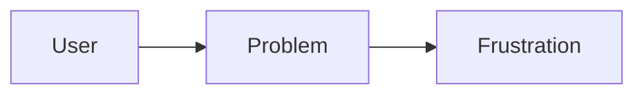

# Presentation Framework — Technical Specification

## Overview

A single-file, zero-server HTML/JS presentation framework where slides are authored in Markdown. Each slide deck is defined by a single JSON config file and a folder of Markdown files. It runs by opening `index.html` directly in a browser (`file://` protocol).

---

## File & Folder Structure

```
presentation/
├── slides.md             # All slide content, separated by ---
├── deck.json             # Deck configuration (see below)
└── assets/
    ├── hero.jpg          # The shared panoramic image used in the top third
    └── diagram.svg       # Any images referenced in slide content

dist/
└── index.html            # Build output — fully self-contained except for fonts, open in any browser
```

Running `node build.js` from the project root reads all source files and writes `dist/index.html`. This is the only command the user ever needs to run. All JS libraries (Marked.js, Mermaid.js), fonts, and assets are base64-inlined into that single file.

---

## deck.json Schema

```json
{
  "title": "My Presentation",
  "theme": "obsidian",
  "image": "assets/hero.jpg",
  "transition_duration_ms": 500,
  "slides": [
    {
      "image_zoom": 1.2,
      "image_center": { "x": 0.5, "y": 0.3 }
    },
    {
      "image_zoom": 1.8,
      "image_center": { "x": 0.2, "y": 0.6 }
    }
  ]
}
```

The `slides` array in `deck.json` is **index-matched** to the slides in `slides.md` (first `---`-delimited block = index 0, etc.). It defines only the image behavior per slide — content comes from `slides.md`.

### Field Definitions

| Field | Type | Description |
|---|---|---|
| `title` | string | Deck title (shown in browser tab) |
| `theme` | string | One of: `obsidian`, `paper`, `aurora` |
| `image` | string | Relative path to the single panoramic hero image used across all slides |
| `transition_duration_ms` | number | Duration of slide transitions in milliseconds (default: 500) |
| `slides[].image_zoom` | number | Zoom multiplier. `1.0` = image fills the panel exactly (cover fit). `1.5` = zoomed in 50%. Minimum: `1.0` |
| `slides[].image_center` | object | Normalized coordinates (0.0–1.0) of the point in the original image that should appear at the center of the image panel. `{x: 0.5, y: 0.5}` = dead center of the image |

**Validation:** The build script must error with a clear message if the number of entries in `deck.json → slides[]` does not match the number of `---`-delimited blocks in `slides.md`.

---

## Layout

### Viewport Division

```
┌──────────────────────────────────┐
│                                  │  ← Top third (33.33vh)
│          IMAGE PANEL             │    Hero image, pan/zoom per slide
│                                  │
├──────────────────────────────────┤
│                                  │
│         CONTENT PANEL            │  ← Bottom two thirds (66.67vh)
│      (rendered Markdown)         │
│                                  │
└──────────────────────────────────┘
```

- Both panels are always exactly viewport height proportions, regardless of content length.
- Content panel scrolls internally if content overflows (custom scrollbar styled per theme).
- No browser scrollbar on the outer page — `body` is `overflow: hidden`.

### Image Panel Behavior

The hero image is rendered as a single `` (or CSS `background-image`) that is transformed using CSS `transform: scale() translate()` to achieve the pan/zoom effect.

**How zoom + center work:**

- At `zoom: 1.0`, `center: {x:0.5, y:0.5}`: image is scaled to `cover` the panel, centered.
- At `zoom: 1.5`, `center: {x:0.2, y:0.6}`: image is scaled to 150% of cover size, and the point at 20% from left / 60% from top of the original image is translated to the panel center.

**Implementation note:** Compute `transform-origin: center center` and derive the `translate` offset from the difference between `image_center` and `(0.5, 0.5)`, scaled by the image's rendered dimensions at the given zoom level.

---

## Slide Transitions

### Behavior

On advancing to the next slide (or going back to the previous):

1. **Content panel:** Current slide content animates out (slides left + fades out simultaneously). Incoming slide content slides in from the right + fades in. On going *back*, reverse directions (current exits right, new enters from left).

2. **Image panel:** The hero image does **not** swap — it is the same image element throughout. Its `transform` (zoom + translate) animates smoothly from the current slide's values to the next slide's values using CSS `transition` with `ease-in-out` easing. Duration matches `transition_duration_ms`.

### CSS Approach

```
Content exit  → transform: translateX(-8%) + opacity: 0
Content enter → transform: translateX(8%)  → translateX(0) + opacity: 1
Image pan/zoom → CSS transition on transform property of image element
```

All three animations run in parallel and complete in the same duration.

### No transition skipping

If the user advances slides rapidly (keyboard/click spam), queue transitions — do not interrupt a running transition mid-way. Allow at most one queued slide change.

---

## Markdown Slide Format

All slides live in a single `slides.md` file. Slides are delimited by `---` on its own line. The first slide begins at the top of the file — no leading `---` is needed.

### Example slides.md

```markdown
# Introduction

Welcome to the presentation framework.

- Built with HTML and JS
- Authored in Markdown

---

# The Problem

Some content here.



---

# Our Solution


More content below the image.
```

### Slide Anatomy Convention (not enforced, but styled)

- The first `# H1` heading in a slide is treated as the slide title — rendered larger and styled distinctively per theme.
- Remaining content flows naturally below.

---

## Navigation

| Action | Trigger |
|---|---|
| Next slide | `→` arrow key, `Space`, click anywhere on content panel, or on-screen `›` button |
| Previous slide | `←` arrow key, or on-screen `‹` button |
| Jump to slide N | Slide indicator dots at bottom (click) |
| Toggle fullscreen | `F` key or fullscreen button |
| Open slide overview | `Escape` key — shows grid of all slides |

### UI Controls

- Minimal overlay controls — visible on hover, hidden otherwise.
- Progress indicator: a thin progress bar along the very bottom of the viewport, showing position through the deck.
- Slide counter: "3 / 12" shown bottom-right.
- Navigation arrows: bottom-left and bottom-right corners, semi-transparent.

---

## Themes

All themes share the same layout. They differ in: color palette, typography, content panel background, scrollbar style, and code block styling.

### Theme 1: `obsidian`

A dark, high-contrast professional theme.

- **Background:** Near-black `#0f1117`
- **Surface (content panel):** `#1a1d27`
- **Primary text:** Off-white `#e8eaf0`
- **Accent:** Electric indigo `#7c6af7`
- **Headings font:** `"Inter"` or `"DM Sans"` — bold, tight tracking
- **Body font:** `"Inter"` — regular weight
- **Code blocks:** Dark surface with syntax highlighting (light-on-dark)
- **Vibe:** Polished tech/engineering deck

### Theme 2: `paper`

A light, editorial, print-inspired theme.

- **Background:** Warm white `#faf8f4`
- **Surface (content panel):** `#ffffff`
- **Primary text:** Near-black `#1a1a1a`
- **Accent:** Terracotta `#c0533a`
- **Headings font:** `"Playfair Display"` — serif, high contrast
- **Body font:** `"Source Sans 3"` — clean humanist sans
- **Code blocks:** Warm cream background `#f2ede6`, dark text
- **Vibe:** Academic lecture, design critique, editorial presentation

### Theme 3: `aurora`

A vivid dark theme with gradient accents — energetic and modern.

- **Background:** Deep navy `#0a0e1a`
- **Surface (content panel):** `#111827` with subtle gradient overlay
- **Primary text:** `#f0f4ff`
- **Accent:** Gradient from cyan `#22d3ee` to violet `#a78bfa`
- **Headings font:** `"Space Grotesk"` — geometric, wide
- **Body font:** `"Inter"`
- **Code blocks:** Deep navy, accent-colored syntax highlights
- **H1 headings:** Rendered with the gradient applied as a `background-clip: text` effect
- **Vibe:** Conference keynote, product launch, startup pitch

> **Font loading:** All fonts must be bundled via `@font-face` with local `.woff2` files, OR the spec must acknowledge that fonts fall back gracefully to system equivalents when offline. Recommend including a fallback stack for each theme.

---

## Slide Overview Mode (`Escape`)

- Pressing `Escape` pauses transitions and shows a grid of all slides as thumbnail cards.
- Each card shows: slide number, H1 title extracted from the Markdown, and a miniature preview of the image panel at that slide's zoom/center.
- Clicking a card immediately transitions to that slide and exits overview mode.
- Pressing `Escape` again exits overview mode without changing slide.

---

## Technical Constraints & Notes

1. **Build script is the entry point.** `node build.js` is the only command. It uses only Node.js stdlib (`fs`, `path`). No `npm install` required. Output is `dist/index.html` — a single fully self-contained file.

2. **Inlining strategy:**
   - JS libraries (Marked.js, Mermaid.js): download specific versions and inline as `<script>` content
   - Fonts: embed a single Google Fonts `<link>` tag covering all five typefaces (Inter, DM Sans, Playfair Display, Source Sans 3, Space Grotesk). Fonts load at display time — an internet connection is required for correct typography.
   - Hero image and any images referenced in slides: base64-encode and replace `src`/`url()` references
   - Slide Markdown content: embed in a `<script type="application/json" id="slide-data">` tag as JSON
   - `deck.json` config: embed similarly as JSON in a `<script>` tag

3. **Mermaid.js rendering** must be triggered after each slide's DOM is inserted into the content panel, not on page load. Re-initialize per slide transition.

4. **Image transform math** must handle edge cases: images narrower or shorter than the panel at the given zoom level, `zoom < 1.0` (clamp to 1.0), `image_center` values outside 0–1 (clamp to 0–1).

5. **Accessibility:** Keyboard navigation must work without a mouse. Content panel gets `role="region"` with `aria-label="Slide N of M"` updated on each transition. All transitions respect `prefers-reduced-motion`: if set, skip animation and snap instantly.

6. **HTML in Markdown:** Allowed and not sanitized, since content is always user-authored locally. Document this in the README.

---

## Deliverables Checklist for Claude Code

- [ ] `build.js` — Node.js build script (no external dependencies); reads source files, writes `dist/index.html`
- [ ] `deck.json` — example deck configuration
- [ ] `slides.md` — example slide content demonstrating all Markdown features (headings, lists, images, code blocks, Mermaid diagrams)
- [ ] `README.md` — authoring guide: how to write slides, configure `deck.json`, run `node build.js`, open `dist/index.html`, and add a new theme. Must note that an internet connection is required for font rendering.

---

## Resolved Decisions

| # | Question | Decision |
|---|---|---|
| 1 | Font strategy | Load from Google Fonts at display time via `<link>` tags embedded in the build output. Fonts required: Inter, DM Sans, Playfair Display, Source Sans 3, Space Grotesk. The `assets/fonts/` folder is not needed. The presentation requires an internet connection for correct font rendering; all other content (slides, images, diagrams) remains fully offline-capable. |
| 2 | `file://` loading strategy | Build script (`build.js`, Node.js, no dependencies beyond stdlib). Reads `deck.json` + `slides.md` + all assets, inlines everything into a single `dist/index.html`. Running `node build.js` is the only required step. |
| 3 | Slide file format | **Single file with `---` separators.** One `slides.md` file in the deck root. Each slide is delimited by a `---` on its own line. The first slide starts at the top of the file (no leading `---` required). |
| 4 | Mermaid version | Latest stable at time of build. |
| 5 | Mobile/touch support | Yes. Swipe left = next slide, swipe right = previous slide. Minimum swipe distance threshold: 50px. |
| 6 | Speaker notes | Not implemented. |
