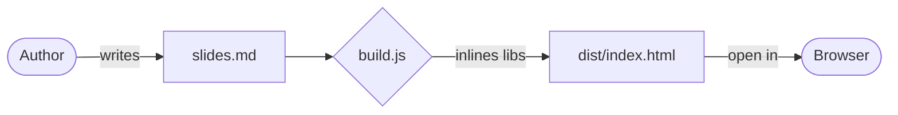

# Presentation Framework
*italic* _bold_
A zero-server slide deck engine powered by **Markdown** and a single build command.

- Author slides in plain text — no GUI required
- Pan and zoom the hero image independently per slide
- Three polished themes: `obsidian`, `paper`, `aurora`
- Runs from `file://` — no web server needed

---

# The Problem

Building slide decks today means fighting proprietary tools:

> "I just want to write text and have it look good!"

Common pain points:

1. Lock-in to cloud services
2. Poor version control story
3. Slow, bloated editors
4. Hard to automate

---

# Our Solution

The build pipeline is deliberately minimal:

```
slides.md  +  deck.json  +  assets/
      │               │
      └───── node build.js ─────▶  dist/index.html
```

- **One command** to build: `node build.js`
- **One file** to share: `dist/index.html`
- **Zero dependencies**: only Node.js stdlib needed

---

# Mermaid Diagrams

Diagrams are first-class citizens. Write them inline:



Mermaid is automatically rendered on each slide transition.

---

# Code Blocks

Syntax highlighting works out of the box via Marked.js. Example in TypeScript:

```typescript
interface SlideConfig {
  image_zoom: number;
  image_center: { x: number; y: number };
}

function clamp(v: number, lo: number, hi: number): number {
  return Math.max(lo, Math.min(hi, v));
}
```

Blockquotes also render beautifully:

> "Simplicity is the ultimate sophistication." — Leonardo da Vinci

---

# Thank You

Press `Escape` to open the slide overview, or use `←` `→` to navigate.

| Key / Action | Effect |
|---|---|
| `→` or `Space` | Next slide |
| `←` | Previous slide |
| `F` | Toggle fullscreen |
| `Escape` | Slide overview |
| Click dots | Jump to slide |
